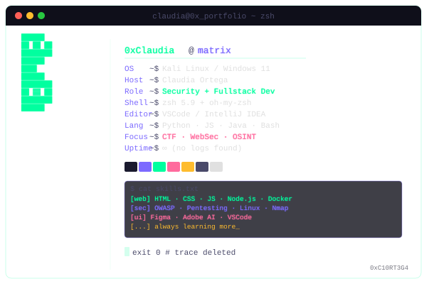

<!-- ████████████████████████████████████████████████████████ -->
<!--  TRACE INITIATED — claudia@0x_portfolio                  -->
<!-- ████████████████████████████████████████████████████████ -->

```
  ██████╗ ██╗  ██╗ ██████╗██╗      █████╗ ██╗   ██╗██████╗ ██╗ █████╗
 ██╔═████╗╚██╗██╔╝██╔════╝██║     ██╔══██╗██║   ██║██╔══██╗██║██╔══██╗
 ██║██╔██║ ╚███╔╝██║      ██║     ███████║██║   ██║██║  ██║██║███████║
 ████╔╝██║ ██╔██╗ ██║     ██║     ██╔══██║██║   ██║██║  ██║██║██╔══██║
 ╚██████╔╝██╔╝ ██╗╚██████╗███████╗██║  ██║╚██████╔╝██████╔╝██║██║  ██║
  ╚═════╝ ╚═╝  ╚═╝ ╚═════╝╚══════╝╚═╝  ╚═╝ ╚═════╝ ╚═════╝ ╚═╝╚═╝  ╚═╝
```
<div align="center">
[](https://git.io/typing-svg)

</div>

<!-- <div align="center"> -->
<!--  -->
<!-- </div> -->

<div align="center">

---


```bash
┌──(0xClaudia㉿matrix)-[~]
└─$ whoami
```

</div>

```
> identity   : Claudia Ortega
> role        : Security-focused Full-Stack Developer
> status      : [ACTIVE] — building, breaking & learning
> location    : /dev/null  (trace wiped)
> clearance   : student → operator
```

---

<div align="center">

```bash
┌──(0xClaudia㉿matrix)-[~]
└─$ cat /etc/skills.conf
```

</div>

<div align="center">


</div>

```bash
[languages]     Python · JavaScript · Java · Bash · HTML · CSS
[frameworks]    Node.js · Docker
[tools]         Figma · VSCode · IntelliJ IDEA · PowerShell
[security]      Linux · Network analysis · OWASP · recon tools
[design]        Adobe Illustrator · UI/UX prototyping
```

---

<div align="center">

```bash
┌──(0xClaudia㉿matrix)-[~]
└─$ cat objectives.txt
```

</div>

```
[01] — Web & mobile application development
[02] — Cybersecurity: offensive & defensive
[03] — Open source contribution
[04] — CTF challenges & security research
[05] — Building tools that matter
```

---

<div align="center">

```bash
┌──(0xClaudia㉿matrix)-[~/stats]
└─$ ./fetch_metrics.sh --user ogclau
```

</div>

<p align="center">
  
  <br/>
  
</p>

<p align="center">
  
</p>

<p align="center">
  
  
  
</p>

---

<div align="center">

```
┌──(0xClaudia㉿matrix)-[~]
└─$ exit

[session terminated]
[logs encrypted & deleted]
[no trace found]

▓▓▓▓▓▓▓▓▓▓▓▓▓▓▓▓▓▓▓▓ 100%  done.
```

</div>

<!-- EOF — 0xC10RT3G4 -->
